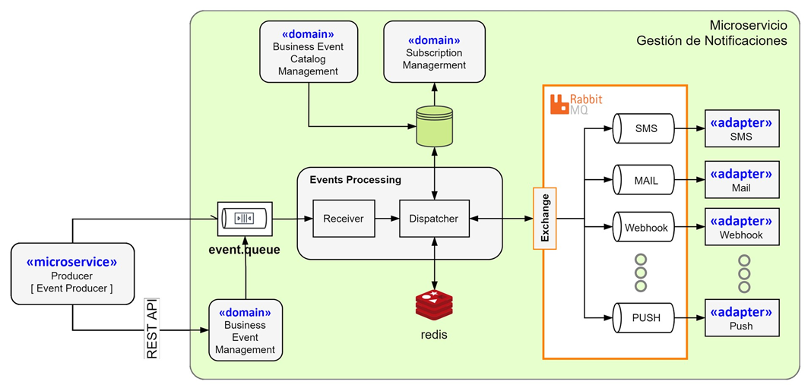

# messaging-service
MS Servicio para Mensajería

El presente microservicio tiene por objetivo recibir eventos de negocio que se producen como parte de la operación de los diferentes microservicios de una solución y ser publicados a través de diferentes canales (SMS, Mail, Mensajes PUSH, Webhook, entre otros). La arquitectura referencial es la siguiente:

